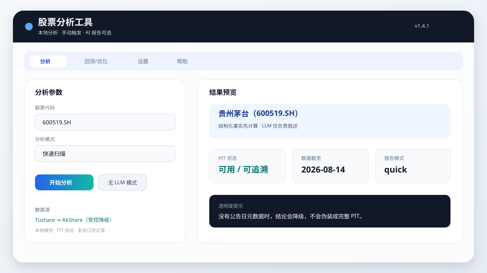

# stock_analysis

**个人轻量化 A 股分析工具：本地计算负责事实与指标，LLM 仅负责报告生成，强调可复现与数据质量。**



Windows 用户可直接使用现有的 [GitHub v1.4.1 Release](https://github.com/lajark/stock_analysis/releases/tag/v1.4.1) 或 [Gitee v1.4.1 Release](https://gitee.com/li_nanqi/stock_analysis/releases/tag/v1.4.1)。本轮维护不重复创建 Release。

## 为什么做这个项目

多数 AI 股票工具让模型直接接触数字。本项目把数值链路留在本地，并把数据口径显式记录下来：

- **Local-first**：数据获取、缓存、指标、财务比率、估值和风险计算在本地完成。
- **Reproducible**：相同输入、分析时点和配置可重新生成相同的结构化分析包。
- **PIT-aware**：财务数据区分报告期与公告日，检查未来信息和修订版本。
- **LLM-not-the-calculator**：LLM 只总结和解释精简分析包，不计算财务数字、技术指标、复权、排名或核心评分。

本项目面向希望核对计算过程的个人研究者，不是自动荐股服务、自动交易系统，也不保证收益。

## 主要能力

- 支持 `quick`、`deep`、`value`、`trade` 四种分析模式。
- Tushare 主源、AkShare 受控降级，缓存供应商、质量、数据截至日和复权元数据。
- 使用 `--no-llm` 零 Token 输出本地 JSON 分析包。
- 将结构化分析包渲染为 Markdown 报告。
- 提供研究用途的回测、参数优化、官方披露核验和复权对账工具。

## 快速开始

```bash
pip install -e .
cp .env.example .env
# 编辑 .env 设置 TUSHARE_TOKEN；LLM_API_KEY、LLM_BASE_URL、LLM_MODEL 可选

# WebView 桌面界面
python -m src.app.webgui.app

# CLI
python -m src.app.cli analyze --ticker 600519 --mode trade
python -m src.app.cli analyze --ticker 600519 --mode quick --no-llm
```

安装版不需要 Python。设置、缓存、日志和报告位于 `%LOCALAPPDATA%\\StockAnalysis\\`，卸载程序默认保留用户数据。

## 数据质量与方法透明度

项目区分报告期 `end_date` 与公开公告日 `ann_date`/`f_ann_date`。分析时点之后才公告的记录会被阻断；同一报告期的多个公开版本按确定规则选择，并保留审计信息。若供应商没有公告元数据，运行会明确降级，不宣称完整的 PIT 保证。

原始、前复权（`qfq`）和后复权（`hfq`）行情不可混用。请求复权时必须有完整因子，缺失因子会失败，不会静默退回原始价格。详细字段、公式、限制和离线验证方式见[方法说明](docs/methodology.md)。

## 回测与参数优化

回测和优化是研究工具，采用“收盘产生信号、次日开盘执行”的长仓双均线策略和显式 A 股成本模型。优化结果不会自动写入分析逻辑；Web UI 中采用建议参数后是全局 MA 设置，会影响后续所有股票的技术指标 MA 周期。

```bash
python -m src.app.cli backtest --ticker 600519 --start 2020-01-01 --end 2025-12-31 --fast 20 --slow 60
python -m src.app.cli optimize-rolling --ticker 600519 --start 2020-01-01 --end 2025-12-31 --train-size 500 --validation-size 200 --test-size 200
```

## 示例报告与 Benchmark

- [脱敏示例报告](docs/examples/sample-report.md)：固定公开样本形状，不含密钥、本机路径或用户历史。
- [Benchmark v1](benchmarks/README.md)：用户自行准备官方材料，在本地验证公告元数据、PIT 选择和复权计算。

```powershell
python scripts/run_public_benchmark.py `
  --manifest benchmarks/v1/manifest.json `
  --source-dir path/to/local-materials `
  --output-dir .workspace/tmp/public-benchmark
```

Benchmark 默认离线运行，不下载报告、不改变生产缓存。

## 项目结构

```text
src/data/       数据源、缓存、PIT 与复权
src/analysis/   指标、基本面、估值、风险和证据契约
src/reports/    结构化上下文、LLM 客户端和 Markdown 渲染
src/app/        CLI、WebView GUI 和共用服务
docs/           方法说明和公开示例
benchmarks/     仅清单，不放原始 PDF 或完整行情
scripts/        构建、审计、发布和 benchmark 工具
tests/          单元与契约测试
```

离线回归与维护集检查：

```powershell
python -m pytest tests/ -v -m "not integration"
python -m ruff check src scripts tests
python scripts/pre_push_scan.py
```

联网供应商契约测试需显式选择 `integration`，不会作为默认离线回归的一部分。

## 限制与免责声明

- 供应商数据可能延迟、修订、不完整或暂时不可用。
- PIT 保证依赖公告元数据；缺失元数据会报告为降级质量。
- 回测是描述性研究工具，不代表未来收益。
- 本软件仅供研究和教育使用，不执行交易，不构成投资建议。重要事实请回到原始披露文件核对。

详见[英文 README](README.md)、[分发政策](DISTRIBUTION_POLICY.md)、[第三方声明](THIRD_PARTY_NOTICES.md)和 [LICENSE](LICENSE)。
